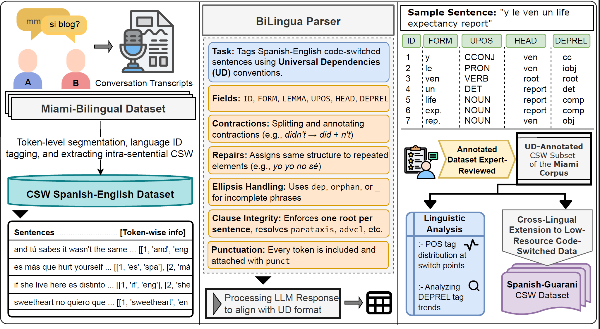

# Parsing the Switch: LLM-Based UD Annotation for Complex Code-Switched and Low-Resource Languages
Code-switching presents a complex challenge for syntactic analysis, especially in low-resource language settings where annotated data is scarce. While recent work has explored the use of large language models (LLMs) for sequence-level tagging, few approaches systematically investigate how well these models capture syntactic structure in code-switched contexts. Moreover, existing parsers trained on monolingual treebanks often fail to generalize to multilingual and mixed-language input. To address this gap, we introduce the \textit{BiLingua Parser}, an LLM-based annotation pipeline designed to produce Universal Dependencies (UD) annotations for code-switched text. First, we develop a prompt-based framework for Spanish-English and Spanish-Guaraní data, combining few-shot LLM prompting with expert review. Second, we release two annotated datasets, including the first Spanish-Guaraní UD-parsed corpus. Third, we conduct a detailed syntactic analysis of switch points across language pairs and communicative contexts. Experimental results show that BiLingua Parser achieves up to \textbf{95.29\%} LAS after expert revision, significantly outperforming prior baselines and multilingual parsers. These results show that LLMs, when carefully guided, can serve as practical tools for bootstrapping syntactic resources in under-resourced, code-switched environments



---

### 📊 Dataset Format
The `data/` folder contains annotated input datasets used by the tagging scripts. Each row corresponds to a code-switched sentence, its tokenization, and UD annotations.

1. `spanish_english.csv` 
    This dataset contains code-switched sentences mixing Spanish and English, with token-level information and GPT tagging fields.
    | Column Name      | Description                                                                |
    | ---------------- | -------------------------------------------------------------------------- |
    | `sentence_id`    | Unique identifier for each sentence                                        |
    | `filename`       | Source file from which the sentence is drawn                               |
    | `sentence`       | Full code-switched sentence                                                |
    | `multiple_words` | Flag (`1` or `0`) indicating if sentence has multiple tokens in both langs |
    | `token_info`     | List of tuples: `[token_id, token_text, lang_tag]` for each token          |
    | `UD_depd`        | List of dictionaries for each token with GPT-generated UD annotations      |
    | `Special Case`   | Binary or categorical marker for custom filtering (e.g., repetitions)      |


2. `spanish_guarani.csv`
    This dataset contains Guarani-Spanish code-switched data with dependency annotations and flags for emoji inclusion.
    | Column Name   | Description                                                            |
    | ------------- | ---------------------------------------------------------------------- |
    | `sentence_id` | Unique identifier for each sentence                                    |
    | `has_emoji`   | Binary flag indicating presence of emojis in the sentence (`0` or `1`) |
    | `sentence`    | The code-switched sentence                                             |
    | `token_info`  | List of tuples: `[token_id, token_text, lang_tag]` for each token      |
    | `UD_depd`     | List of dictionaries for each token with GPT-generated UD annotations  |
---
### 🧠 Understanding the `UD_depd` Column

The `UD_depd` column contains the output of syntactic dependency tagging for each sentence. Each value is a list of dictionaries that conforms to the [Universal Dependencies](https://universaldependencies.org/) standard.

#### 🧾 Example Entry

```json
[
  {"ID": 1, "FORM": "él", "LEMMA": "él", "UPOS": "PRON", "HEAD ID": 2, "HEAD": "empezó", "DEPREL": "nsubj"},
  {"ID": 2, "FORM": "empezó", "LEMMA": "empezar", "UPOS": "VERB", "HEAD ID": 0, "HEAD": "root", "DEPREL": "root"},
  {"ID": 3, "FORM": "a", "LEMMA": "a", "UPOS": "PART", "HEAD ID": 4, "HEAD": "trabajar", "DEPREL": "mark"},
]
```
Each token dictionary includes:
| Key       | Description                                               |
|-----------|-----------------------------------------------------------|
| `ID`      | Position of the token in the sentence (starting from 1)   |
| `FORM`    | Surface form of the token                                 |
| `LEMMA`   | Lemmatized (dictionary/base) form                         |
| `UPOS`    | Universal Part-of-Speech tag                              |
| `HEAD ID` | ID of the syntactic head token (0 = root of the sentence) |
| `HEAD`    | FORM of the syntactic head token                          |
| `DEPREL`  | Dependency relation between the token and its head        |


---

### 🛠 Installation

1. Clone the repository to your local machine:
    ```bash
    git clone <repository_url>
    cd <repository_directory>
    ```
2. Install the dependencies using `pip`:
    ```bash
    pip install -r requirements.txt
    ```
3. Set up your OpenAI API Key:
   - You should add your OpenAI API key to your environment variables. For example:
     - On Linux/macOS:
       ```bash
       export OPENAI_API_KEY="your-api-key-here"
       ```
     - On Windows (CMD):
       ```bash
       set OPENAI_API_KEY="your-api-key-here"
       ```

---

### 🚀 Usage

1. **To run the Spanish-English tagging script:**
     ```bash
     python spaeng.py
     ```

2. **To run the Spanish-Guarani tagging script**
     ```bash
     python spagua.py
     ```
   - Make sure to update the file paths within the script to point to your local data files.

---

### 📚 Dataset Citations

The datasets used in this project originate from the following sources:

- **Spanish-Guarani Dataset**  
  Luis Chiruzzo, Marvin Agüero-Torales, Gustavo Giménez-Lugo, Aldo Alvarez, Yliana Rodríguez, Santiago Góngora, and Thamar Solorio.  
  *Overview of GUA-SPA at IberLEF 2023: Guarani-Spanish Code Switching Analysis.*

- **Spanish-English (Miami) Corpus**  
  Margaret Deuchar, Peter Davies, Judith Herring, María C. Parafita Couto, and Dan Carter.  
  *Building Bilingual Corpora.* In Enlli M. Thomas and Ineke Mennen (eds.),  
  **Advances in the Study of Bilingualism**, pp. 93–110. Multilingual Matters, Bristol, 2014.
  
---


### 🔒 Disclaimer

The versions of the datasets (`spanish_english.csv` and `spanish_guarani.csv`) included in this repository are directly generated by our **BiLingua** parser and have not undergone full manual review.

- They reflect automatic annotations based on prompt-guided outputs from GPT models.
- Minor inconsistencies, errors, or annotation mismatches may still be present.

📝 **A fully corrected and linguistically reviewed version of these datasets will be released after the acceptance of the corresponding paper.**

